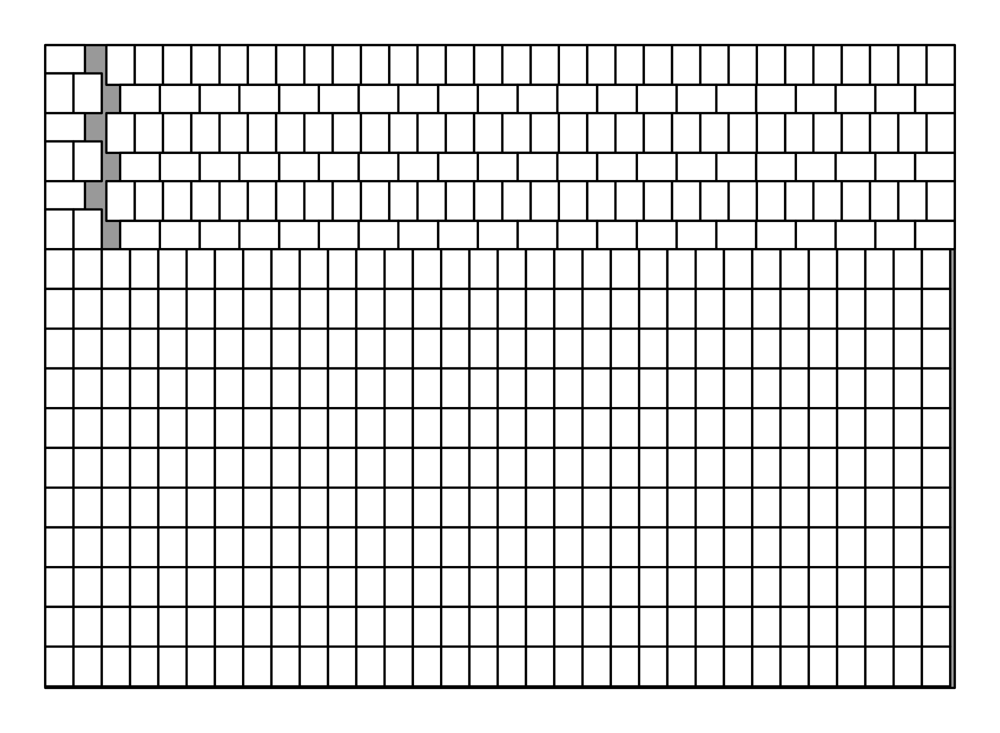

# Rectangle filler

Code to generate A size paper packings for [Matt Parker's video on this](TODO: link).

A size paper is defined by:

- A0 paper is 841mm by 1190mm. This is very close to having sides in the ratio $1:\sqrt2$ and
  an area of 1m².
- for n>0, the size An paper is the smallest side of A(n-1) paper by half the largest side
  of A(n-1) paper rounded down to the nearest mm.

Due to the rounding down, the area of An paper is sometimes strictly less that half the area of
A(n-1) paper. If the sizes were exactly half at each step, you would always be able to
fit $2^{m-n}$ copies of Am paper on a sheet of An paper (for m>n). But because of this rounding,
it is sometimes possible to fit more than this. For example, you can fit 514 (ie more than 512)
pieces of A9 on a piece of A0 paper:

The code in this repository computes arrangements of paper like this.

## Computing arrangments (with an assumption)
The main solver in this repository makes an assumption about the arrangement of smaller pieces of
paper: it assumes that the arrangment is made up of rows of landscape, portrait or mixed pieces of paper.
For example, the A0 and A9 example above contains 11 rows of A9 in portrait and three rows of mixed
portrait and landscape.

Running the file [row_solver.py](row_solver.py) will generate json files in the folder
`output/json` and low resolution matplotlib images in the folder `output/img`.
The filenames of the files created will be
`{large paper size}-{small paper size}-{number of small pieces}-{number this is more than 2^(m-n)}extra.{extension}`.
For example, the file `A0-A9-514-2extra.json` will contain information about how to fit
514 pieces of A9 paper (which is 2 more than the 512 that would be possible without rounding)
on a piece of A0 paper.

Each json file generated contains a list of rectangles in the possible arrangement,
with each rectangle stored in the format `[[x0, y0], [x1, y1]]` where (x0,y0) and (x1,y1)
are the coordinates of the bottom left and top right corners of the rectangle.

If you'd like to play with the solutions without running the code yourself, you can download
the json files from [Zenodo](https://doi.org/10.5281/zenodo.19847022).

Once `output/json` has been created (by either running the above command or unzipping the zip
file of solutions, you can run `python make_svgs.png` to generate SVG vector images in the folder
`output/svg`.

## Computing arrangements (with a weaker assumption)
The file [orthogonal_solver.py](orthogonal_solver.py) contains my first attempt at a solver. This
solver assumes that all the smaller pieces are paper are either portrait or landscape, but doesn't
allow them to be rotated by other angles.

This solver is very slow and I have yet to leave it for long enough to get any useful output from it.

This solver can be tested by running `python -m pytest orthogonal_solver.py`

## Computing arrangements (with no assumptions)
There's a chance that there are better solutions where the smaller pieces of paper are rotated
by arbitrary angles. I've not yet written any code for this.

